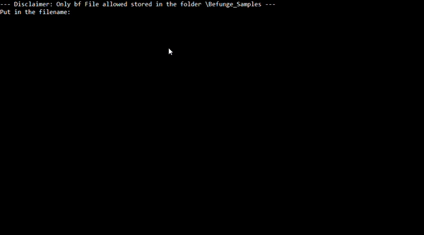
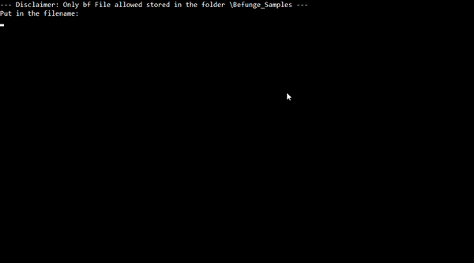

# Befunge-93 Interpreter

This is a console application built with .NET Framework `4.7.2` that interprets code written in the esoteric programming language **Befunge-93**.

  

## Execution Details

To run this program:

1. Navigate to `.\BefungeInterpreter\bin\Debug\`.
2. Execute **_BefungeInterpreter.exe_**.
3. Ensure that the Befunge code is saved in a **.bf** file, located in the `.\Befunge_Samples` directory.

## About Befunge

Befunge is an esoteric programming language known for its two-dimensional code flow. If you'd like to learn more about Befunge and how it works, check out the following resources:

- [Befunge YouTube Video](https://www.youtube.com/watch?v=hMR70JeZ4Zc&t=27s&ab_channel=Truttle1)
- [Befunge on Wikipedia](https://de.wikipedia.org/wiki/Befunge)
